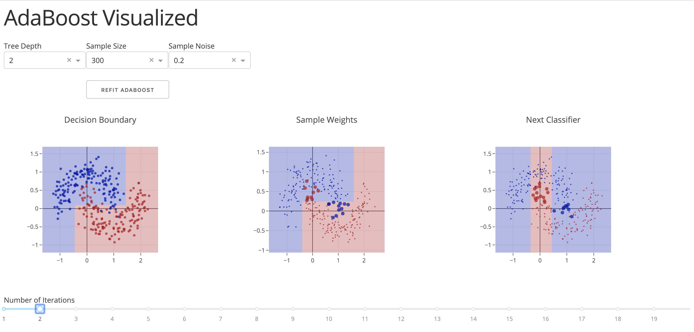

# AdaBoost Visualized

**Author**: Feiyu Chen

**Affiliation**: M.E. Computational Science and Engineering Candidate, John A. Paulson School of Engineering and Applied Sciences
##

**Artifact:**
https://adaboost-visualized.herokuapp.com/

**Code:**
https://github.com/feiyu-chen96/data-science-animation-challenge/blob/master/feiyuchen_code.py

### Explanation

The web app can be found at https://adaboost-visualized.herokuapp.com/.

In case the above deployment is down. The visualization can also be viewed locally. Following are the instructions:
1. Clone this repository by `git clone git@github.com:feiyu-chen96/data-science-animation-challenge.git`
2. Go into the directory by `cd data-science-animation-challenge`
3. Create a virtual environment by `virtualenv venv` (assuming `virtualenv` is installed)
4. Activate the virtual environment by `source venv/bin/activate`
5. Install the dependencies by `pip install -r requirements.txt`
6. Launch the app by `python adaboost_visualized.py`
7. Open a browser and see `http://127.0.0.1:8050/`
8. Close the app by `ctrl+C` and deactive the virtual environment by `deactivate` afterwards

This visualization tries to build a more intuitive understanding of AdaBoost. The interface is as follows:

We can use the dropdowns at the top to configure the base classifier of AdaBoost and the dataset for classification. The Tree Depth dropdown controls the maximum tree depth of the decision tree used in AdaBoost. The Sample Size and Sample Noise control the size and noise of the dataset (which is generated by `sklearn.datasets.make_moons`). After these 3 parameter is set, we can click the REFIT ADABOOST button to regenrate the data and refit the AdaBoost model. (If the app is viewed by acessing the herokuapp url, the button should be clicked twice. I haven't fixed this bug yet.)

The visulization starts at the 1st iteration. The plot on the left shows the decision boundary after the 1st iteration. The blue dots and red dots denote two different classes. The blue area is where the samples are classified to be the blue class and the red area is where the samples are classified to be the red class. The plot in the middle shows the weight assigned to each training example after the 1st iteration. Note that the missclassified examples were given larger weight. The plot on the right shows the next classifier to be added to the ensemble. Note that it tries to fit the missclassified examples better.

20 iterations are calculated in total. The number of iterations can be chosen in the slider at the bottom. (If the app is viewed by acessing the herokuapp url, the updating process may have a little latency (~1s) and the 3 plots will be out of sync during this process.)
